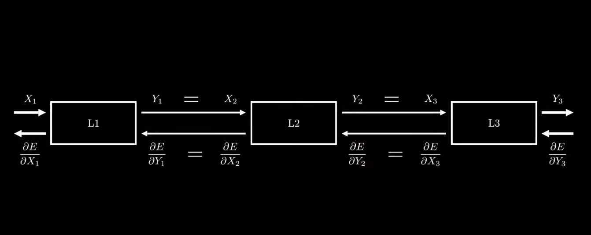

# AMK-NN
Neural Networks Implementation in pure C++.  
The goal was to do everything from scratch without using any external libraries.  

## Image Upscale (demo)
  
Implementation of **implicit representations** on images.  
A **feed-forward multi-layer perceptron** neural network takes the **normalized (x, y)** coordinates of a pixel as input, and produces a **single color** as output.  
By evaluating the function (**nueral network**) on every pixel's (x, y) of the image, we can obtain the full image.  
Therefore, the **discrete** representation of image is converted into **continuous** representation **implicitly** in the form of the **network parameters**.  
  
Since the function (**nueral network**) is continuous, we can interpolate it to get up-scaled image of any resolution.  
The periodic **Sine** function is used as a **non-linearity** (aka. Activation).  

download from [here](https://mega.nz/file/pM0UnBxZ#bbUbsSVTP682dloHIIiZceuk7KeqJ2vdmD0oJAcH7Ys).  

### Preview

  
## How Does It Work ?
This Implementation is limited to **Sequential Neural Networks** only.  
  
Let **$`W`$** be a vector conatning the **Learned Parameters** of the neural network.  
Let **$`X`$** be the input vector.  
Let **$`Y=f(X, W)`$** be the output of the neural network.  
Let **$`Y_{hat}`$** be the expected outputs for the given inputs **$`X_{hat}`$** (Tarining Dataset).  
We need to define an Objective Function **$`E(Y, Y_{hat})`$** (aka. Loss Function).  
We optimize **$`W`$** (in an iterative manner) based on the Dataset **$`(X_{hat}, Y_{hat})`$** to (minimize/maximize) the Objective **$`E(Y, Y_{hat})`$**.  
  
**Forward Pass :**  
  
- Each layer **$`(L_{i})`$** takes the input **$`X_{i}`$** from the previous layer, then computes the output **$`Y_{i}`$** and passes it to the next layer.  
  
**Backward Pass :**  
  
- Each layer **$`(L_{i})`$** takes the gradients of the "loss with respect to output" **$`dE/dY_{i}`$** from the next layer,  
  then computes the gradients of the "loss with respect to input" **$`dE/dX_{i}`$** and passes it to the previous layer.  
- Each layer **$`(L_{i})`$** computes the gradients of the loss with respect to it's **Learned Parameters** (if it has, eg: wieghts, biases, ...) to later optimize them.  
  
Optimization of parameters is done by using **Gradient Descent** algorithm.   
  

## Resources
  
Informative Website : [Machine Learning Mastery](https://machinelearningmastery.com/).  
Little Video : [Upscaling images using Machine Learning & C programming language.](https://youtu.be/ZjxPPvqNp3k?si=xW6iXvHBKnOr0JmR).  
Little Video : [Experiments with machine learning](https://youtu.be/hfMk-kjRv4c?si=zg8HbLHG3dDaQ9Uq).  