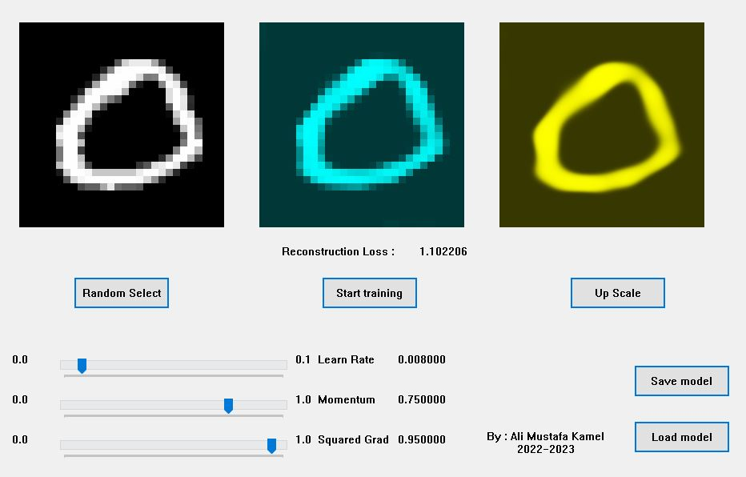

# AMK-NN
Neural Networks Implementation in pure C++.  
The goal was to do everything from scratch without using any external libraries.  

### Demo 1 : Image Upscale
**Status : Completed**  
**About :**  
  
Implementation of **implicit neural representations** on images.  
A **fully-connected** neural network takes the **normalized (x, y)** coordinates of a pixel as input, and produces a **single color** as output.  
By evaluating the function (**nueral network**) on every pixel's (x, y) of the image, we can obtain the full image.  
Therefore, the **discrete** representation of image is converted into **continuous** representation **implicitly** in the form of the **network parameters**.  
  
Since the function (**nueral network**) is continuous, we can interpolate it to get up-scaled image of any resolution.  
The periodic **Sine** function is used as a **non-linearity** (aka. Activation).  

download from [here](https://mega.nz/file/pM0UnBxZ#bbUbsSVTP682dloHIIiZceuk7KeqJ2vdmD0oJAcH7Ys).  

### Preview

### Demo 2 : Painter
**Status : In Progress**  
**About :**  
  
Applying optimization on **parameterized** primative drawing functions (Vector Graphics) such as **( drawLine(), drawCurve(), fillPolygon() )** to generate images.  

### How Does It Work ?
This Implementation is limited to **Sequential Neural Networks** only.  
  
Let **W** be a vector conatning the **Learned Parameters** of the neural network.  
Let **X** be the input vector.  
Let **Y = f(X, W)** be the output of the neural network.  
We need to define an Objective Function **E = g(Y, Y`)** (aka. Loss Function/Cost Function).  
We optimize **W** to (minimize/maximize the Objective).  
  
The Neural Network is made of sequential layers, that do the following :  
- Each layer takes the input (**X**) from the previous layer, then computes & passes the output (**Y**) to the next layer.  
- Each layer takes the gradients of the "loss with respect to output" (**dE/dY**) from the next layer,  
  then computes & passes the gradients of the "loss with respect to input" (**dE/dX**) to the previous layer.  
- Each layer computes the gradients of the loss with respect to it's **Learned Parameters** (if it has, eg: wieghts, biases, ...) to later optimize them.  
  
Optimization of parameters is done by using **Gradient Descent** algorithm.   
  
